[](https://github.com/ellerbrock/open-source-badges/)
[](https://opensource.org/licenses/MIT)


# SIAKLIK
Program magang ini telah kami laksanakan selama kurang lebih enam bulan secara hybrid dari bulan Agustus 2020 hingga bulan Januari 2021. Selama magang, kami berhasil memperbarui sistem website Poliklinik UPN Veteran Jawa Timur. Pembaruan ini dilakukan sebagai upaya untuk memenuhi syarat kelulusan jenjang S1. Website yang dikembangkan telah disesuaikan dengan fenomena yang ada di lapangan. Untuk mengetahui sejauh mana kualitas website ini, diperlukan uji validasi, yang kami lakukan dengan metode Blackbox Testing.

<br><br>

## Kebutuhan Proyek
| Bagian | Deskripsi |
| --- | --- |
| Fitur | Masuk, Pendaftaran, Antrian, Ekspor, Grafik, Paginasi, Pencarian, Buat, Baca, Perbarui, Hapus, Captcha, Hak Akses, DLL  |
| Kode | PHP, HTML, CSS, JS, SQL |
| Kerangka Kerja | Bootstrap 4 |
| Peralatan | Visual Studio Code, XAMPP (PHP Versi 5+) |

<br><br>

## Unduh & Instal
1. XAMPP dengan PHP versi 7.4

   <table><tr><td width="810">

   ```
   https://bit.ly/XAMPP_PHP7_Installer
   ```

   </td></tr></table><br>
   
2. Visual Studio Code

   <table><tr><td width="810">

   ```
   https://bit.ly/VScode_Installer
   ```

   </td></tr></table>

<br><br>

## Basis data
1. Buka ``` XAMPP ```, lalu tekan tombol mulai di bagian ``` Apache ``` & ``` MySQL ```. Hal ini bertujuan untuk dapat mendukung website secara optimal.<br><br>

2. Akses ``` peramban ``` terlebih dahulu untuk membuka panel admin basis data, silakan salin tautan berikut: ``` localhost/phpmyadmin/ ```.<br><br>
   
3. Buat basis data bernama ``` siaklik_db ``` di lokal.<br><br>
   
4. Buka basis data ``` siaklik_db ``` dan Impor ``` siaklik_db.sql ``` di direktori ``` SIAKLIK/database ```.

<br><br>

## Akun Bawaan
| Peran | Surel | Kata Sandi |
| --- | --- | --- |
| Admin | poliklinik@upnvjatim.ac.id | admin123 |
| User | pasien@gmail.com | pasien123 |

<br><br>

## Memulai
1. Unduh repositori ini.<br><br>

2. Ekstrak file yang diunduh.<br><br>
   
3. Buka direktori ``` SIAKLIK ``` ke dalam direktori ``` htdocs ```, yang rinciannya dapat anda lihat sebagai berikut: ``` C:\xampp\htdocs ```.<br><br>
   
4. Silakan buka ``` peramban ``` anda dengan menuliskan: ``` localhost/SIAKLIK/ ```.<br><br>
   
5. Silakan masuk dan akses fitur-fiturnya, selamat menikmati [Selesai].

<br><br>

## Anggota Tim Magang
| NOMOR | NAMA LENGKAP | NPM | PERAN |
| --- | --- | --- | --- |
| 1 | Heri Khariono | 18081010002 | Frontend |
| 2 | Devan Cakra Mudra Wijaya | 18081010013 | Frontend |
| 3 | Haidar Ananta Kusuma | 18081010057 | Backend |
| 4 | Rifky Akhmad Fernanda | 18081010126 | Fullstack |

<br><br>

## Sorotan
<table>
<tr>
<th colspan="3">Beranda</th>
</tr>
<tr>
<td width="280">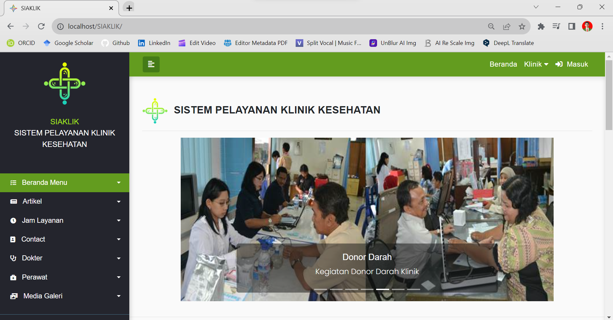</td>
<td width="280">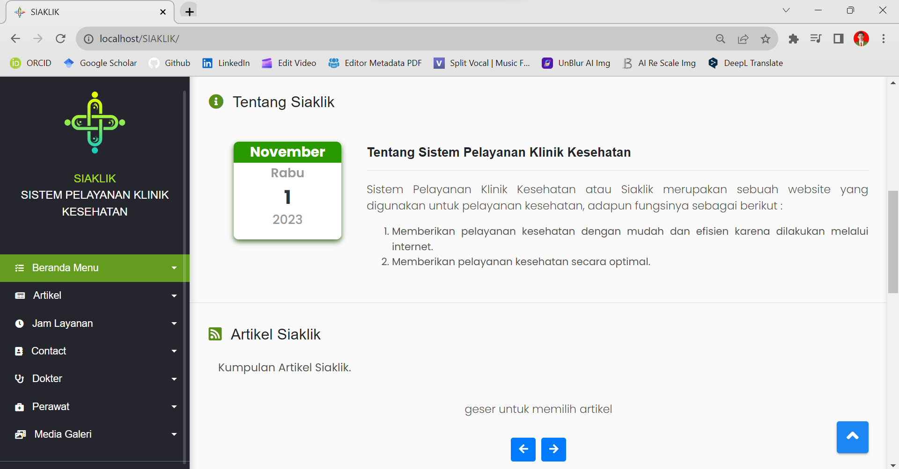</td>
<td width="280">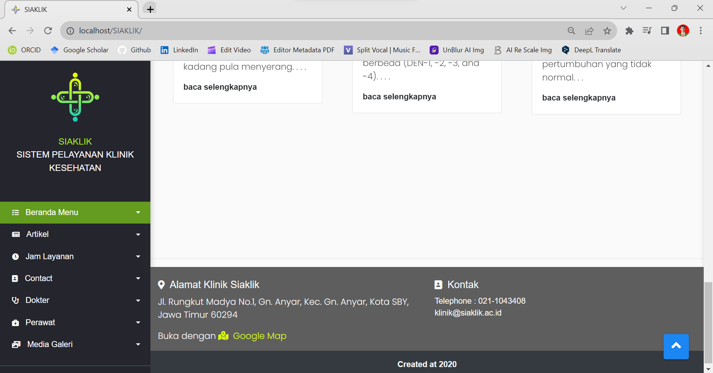</td>
</tr>
</table>
<table>
<tr>
<th width="280">Poli Umum</th>
<th width="280">Poli Gigi</th>
<th width="280">Informasi & Layanan Pasien</th>
</tr>
<tr>
<td></td>
<td></td>
<td></td>
</tr>
</table>
<table>
<tr>
<th colspan="2">Laboratorium Sederhana</th>
</tr>
<tr>
<td width="420"></td>
<td width="420"></td>
</tr>
</table>
<table>
<tr>
<th colspan="2">Rujukan Berjenjang</th>
</tr>
<tr>
<td width="420"></td>
<td width="420"></td>
</tr>
</table>
<table>
<tr>
<th colspan="3">Grafik</th>
</tr>
<tr>
<td width="280">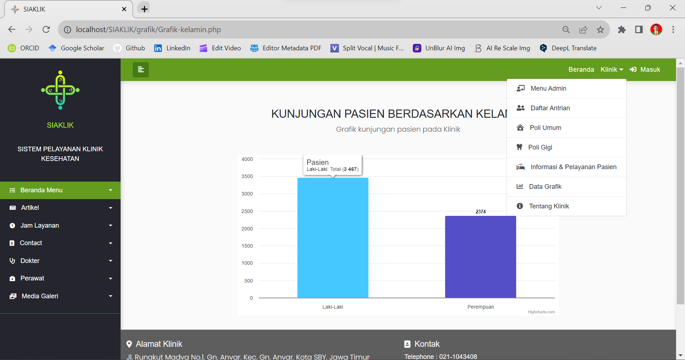</td>
<td width="280">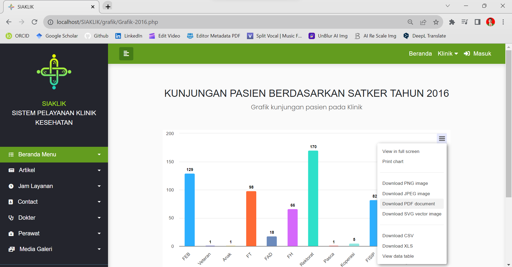</td>
<td width="280">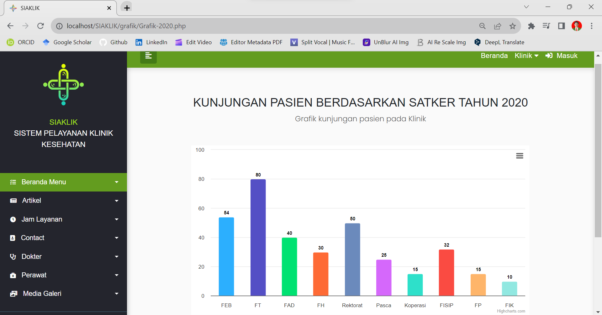</td>
</tr>
</table>
<table>
<tr>
<th colspan="2">Galeri</th>
</tr>
<tr>
<td width="420">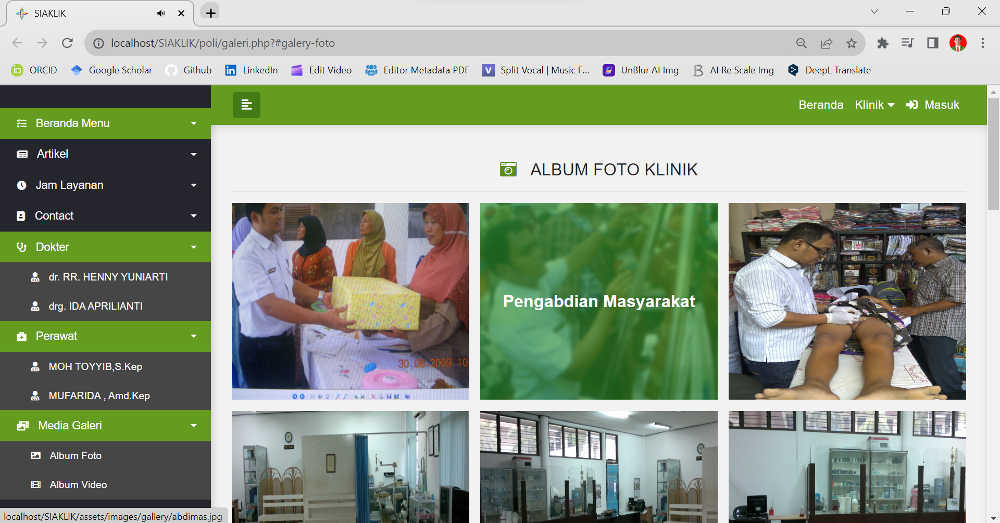</td>
<td width="420"></td>
</tr>
</table>
<table>
<tr>
<th width="420">Masuk</th>
<th width="420">Pendaftaran</th>
</tr>
<tr>
<td>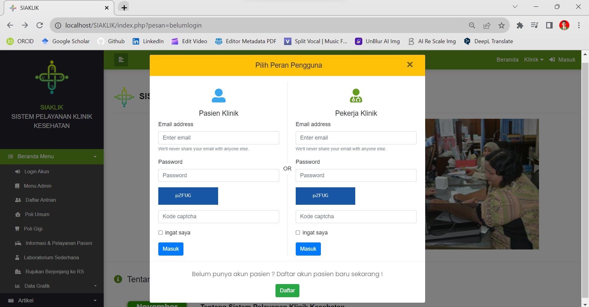
<td>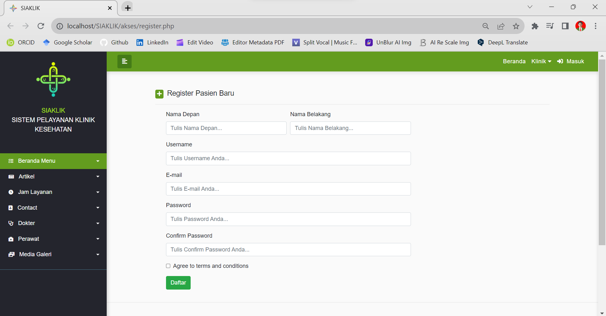
</td>
</tr>
</table>
<table>
<tr>
<th colspan="3">Artikel-artikel</th>
</tr>
<tr>
<td width="280">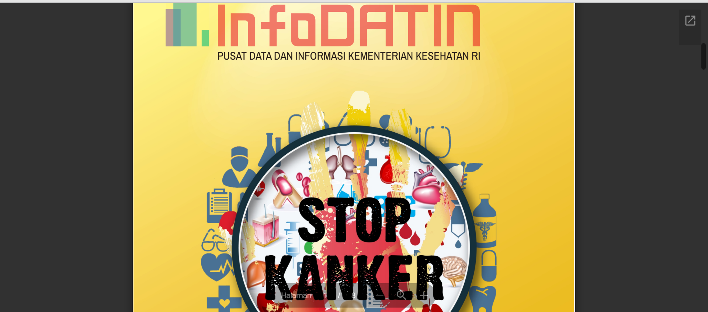</td>
<td width="280">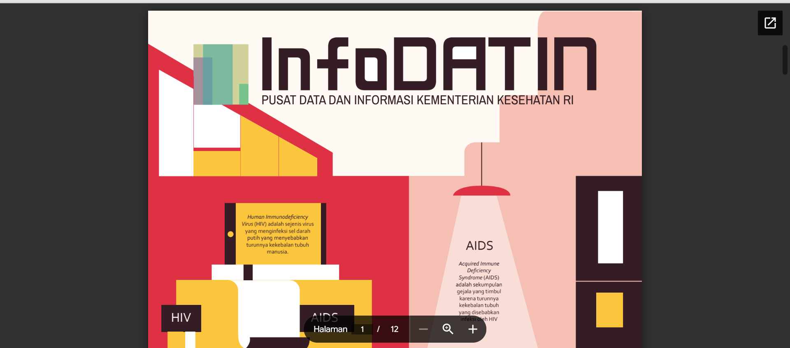</td>
<td width="280"></td>
</tr>
<tr>
<td width="280">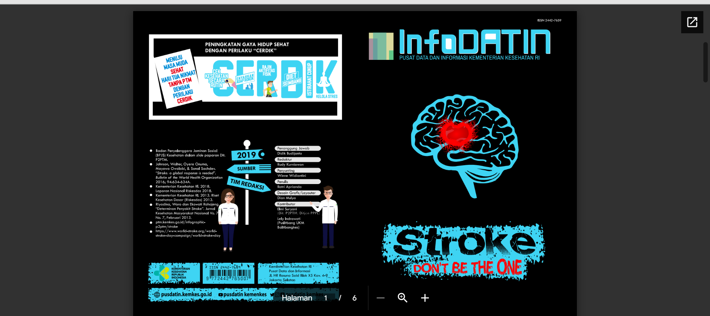</td>
<td width="280">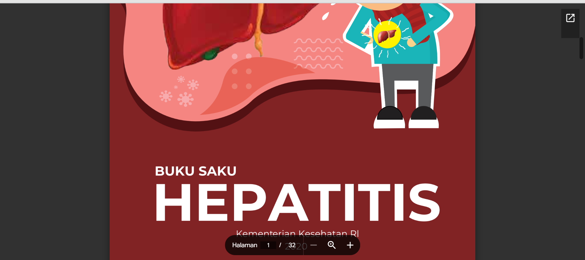</td>
<td width="280">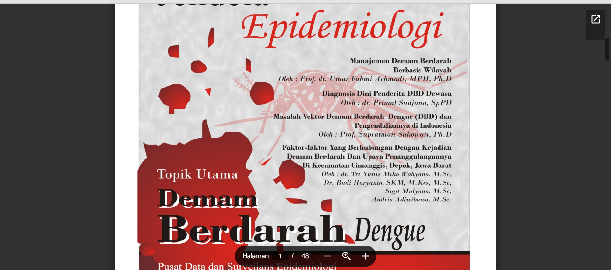</td>
</tr>
</table>
<table>
<tr>
<th width="280">Menu Admin</th>
<th width="280">Data Pasien</th>
<th width="280">Tambah Pasien</th>
</tr>
<tr>
<td></td>
<td></td>
<td></td>
</tr>
</table>
<table>
<tr>
<th width="280">Cari Pasien</th>
<th width="280">Perbarui Pasien</th>
<th width="280">Hapus Pasien</th>
</tr>
<tr>
<td></td>
<td></td>
<td></td>
</tr>
</table>
<table>
<tr>
<th width="280">Ekspor PDF</th>
<th width="280">Data Antrian</th>
<th width="280">Grafik Tahunan</th>
</tr>
<tr>
<td></td>
<td></td>
<td></td>
</tr>
</table>
<table>
<tr>
<th colspan="3">Menu Pasien</th>
</tr>
<tr>
<td width="280"></td>
<td width="280"></td>
<td width="280"></td>
</tr>
<tr>
<td width="280"></td>
<td width="280"></td>
<td width="280"></td>
</tr>
</table>

<br><br>

## Pengingat
1. Anda dapat melihat kekurangan dari website ini pada bagian update data pasien. Pada bagian tersebut, masih belum menampilkan nilai yang didapat dari database, sehingga dirasa kurang nyaman bagi pengguna.<br><br>

2. Jika penambahan otomatis basis data masih belum beres, maka anda dapat melakukan hal berikut ini di phpMyAdmin:

   <table><tr><td width="810">
      
      ```sql
      SET  @num := 0;
      UPDATE your_table SET id = @num := (@num+1);
      ALTER TABLE your_table AUTO_INCREMENT =1;
      ```
   </td></tr></table>

<br><br>

## Apresiasi
Jika karya ini bermanfaat bagi anda, maka dukunglah karya ini sebagai bentuk apresiasi kepada penulis dengan mengklik tombol ``` ⭐Bintang ``` di bagian atas repositori.

<br><br>

## Penafian
Aplikasi ini merupakan hasil karya saya bersama tim saya dan bukan merupakan hasil plagiat dari penelitian atau karya orang lain, kecuali yang berkaitan dengan layanan pihak ketiga yang meliputi: kode editor, library, framework, dan lain sebagainya.

<br><br>

## LISENSI 
LISENSI MIT - Hak Cipta © 2021 - Devan C. M. Wijaya dkk

Dengan ini diberikan izin tanpa biaya kepada siapa pun yang mendapatkan salinan perangkat lunak ini dan file dokumentasi terkait perangkat lunak untuk menggunakannya tanpa batasan, termasuk namun tidak terbatas pada hak untuk menggunakan, menyalin, memodifikasi, menggabungkan, mempublikasikan, mendistribusikan, mensublisensikan, dan/atau menjual salinan Perangkat Lunak ini, dan mengizinkan orang yang menerima Perangkat Lunak ini untuk dilengkapi dengan persyaratan berikut:

Pemberitahuan hak cipta di atas dan pemberitahuan izin ini harus menyertai semua salinan atau bagian penting dari Perangkat Lunak.

DALAM HAL APAPUN, PENULIS ATAU PEMEGANG HAK CIPTA DI SINI TETAP MEMILIKI HAK KEPEMILIKAN PENUH. PERANGKAT LUNAK INI DISEDIAKAN SEBAGAIMANA ADANYA, TANPA JAMINAN APAPUN, BAIK TERSURAT MAUPUN TERSIRAT, OLEH KARENA ITU JIKA TERJADI KERUSAKAN, KEHILANGAN, ATAU LAINNYA YANG TIMBUL DARI PENGGUNAAN ATAU URUSAN LAIN DALAM PERANGKAT LUNAK INI, PENULIS ATAU PEMEGANG HAK CIPTA TIDAK BERTANGGUNG JAWAB, KARENA PENGGUNAAN PERANGKAT LUNAK INI TIDAK DIPAKSAKAN SAMA SEKALI, SEHINGGA RISIKO ADALAH MILIK ANDA SENDIRI.
